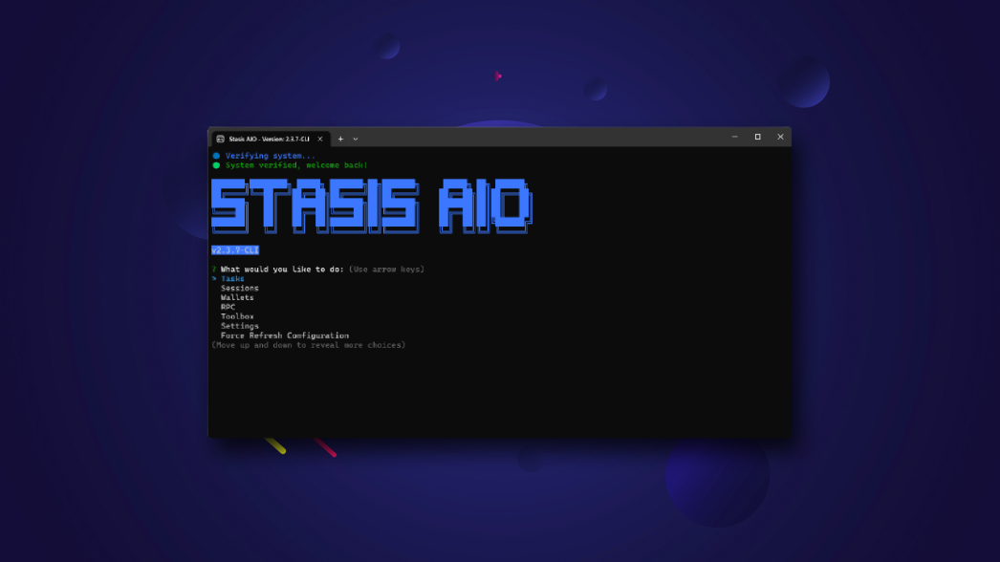

#### Made by [0xPearson](https://devante.dev)

<h1 align="center">☄️ Stasis CLI ☄️</h1>
<h4 align="center">⭐ Don't forget to leave a star! ⭐</h4>

<p align="center">
  
</p>

## Features

- TLS Client
- 🍔 Food
  - California Pizza Kitchen
  - Krispy Kreme
- 🤖 Account Generators
  - Twitter
  - GMAIL
  - Shopify
  - Walmart
  - Target
  - eBay
  - Outlook
- 🧰 Toolbox
  - eBay View Bot
  - Mercari View Bot
  - OfferUp View Bot
  - Spoof Browser
- 🖼️ NFT
  - Solana: Magic Eden Sniper
  - Solana Famous Foxes Token Market Sniper
  - Solana Raydium Token Sniper

Please note - I have removed certain features from the Open Source.

## Breakdown:

StasisCLI is an automation bot designed to help users purchase items, generate unlimited accounts and claim food deals.

## Why Open Source?

I work a full time job now, which I didnt when I initally launched StasisCLI. I unfortunately no longer have the time to continue to update StasisCLI, which is why I have decided to open source - allowing anyone to update what I have already built!

## Not a Developer?

Download the compiled version [here](https://stasis-downloads.s3.amazonaws.com/StasisCLI.zip)

## Requirements

- Datadome API (For Magic Eden Sniper)

## Commands:

#### **Serve For Development**

```
yarn start
```

#### **Build for production**

```
yarn build
```

## License

This software is licensed under the MIT License. See LICENSE.md for more details.
